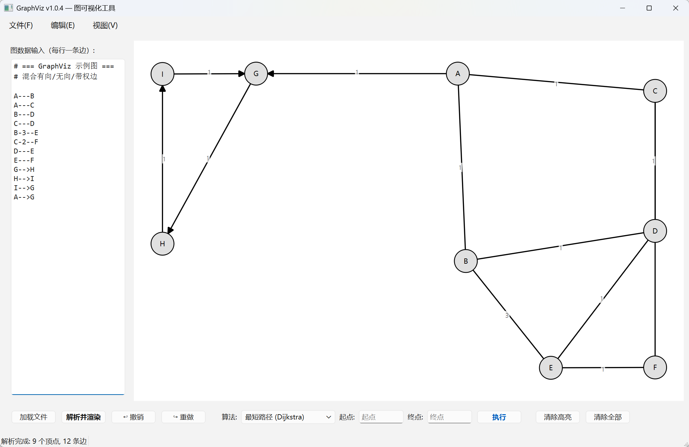
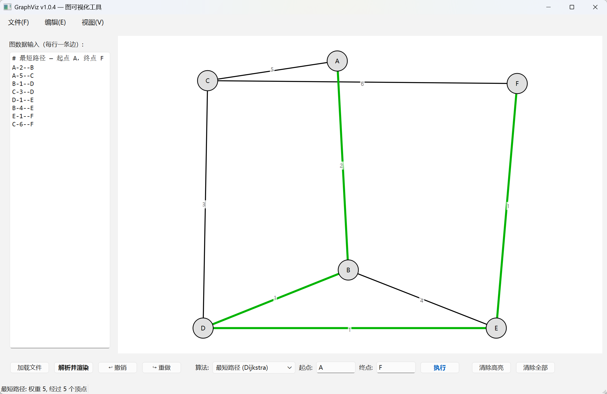
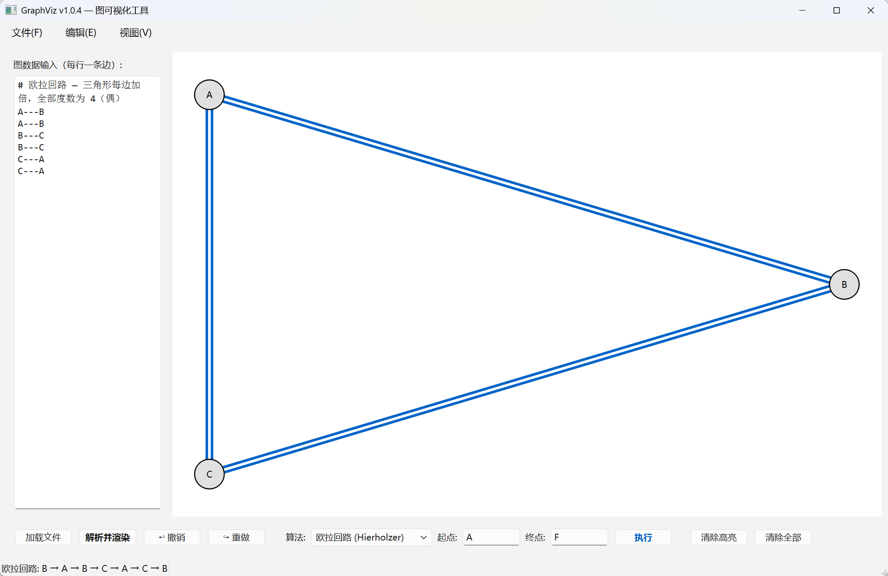
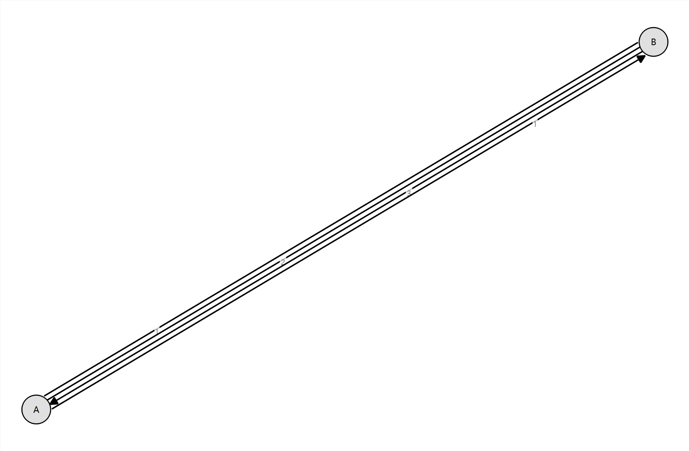
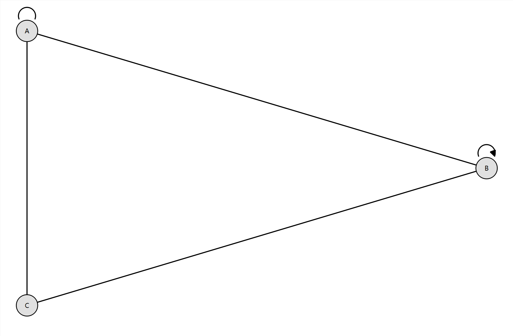

# GraphViz — 图论可视化工具

基于 C++/Qt6 的图论可视化桌面工具。支持有向图和无向图的文本输入、力导向自动布局、鼠标拖拽交互，以及 10 种经典图论算法的高亮展示。无第三方依赖（除 Qt 和 C++ 标准库）。



---

## 项目架构

```
GraphViz/
├── CMakeLists.txt              # 根 CMake（C++17，Qt6 Widgets，AUTOMOC）
├── CMakePresets.json           # CMake 构建预设（default=CLI, gui=Qt6）
├── README.md
├── docs/
│   ├── MANUAL.md               # 用户使用说明书（随包分发）
│   └── screenshots/            # 界面截图
├── include/                    # 公共头文件
│   ├── GraphTypes.h            # Vertex / Edge 数据结构
│   ├── Graph.h                 # 图存储层（邻接表，支持平行边和自环）
│   ├── GraphParser.h           # 边格式文本解析器
│   └── GraphAlgorithm.h        # 10 种算法声明 + 结果结构体
├── src/                        # 实现文件
│   ├── main.cpp                # 应用入口
│   ├── Graph.cpp               # 图存储实现
│   ├── GraphParser.cpp         # 文本解析器实现（手动解析 + 引号名 + 灵活操作符 + 孤立点）
│   ├── GraphAlgorithm.cpp      # 所有图论算法实现
│   └── gui/
│       ├── MainWindow.h/cpp    # 主窗口（输入面板 + 控制栏 + 菜单）
│       ├── GraphWidget.h/cpp   # 图渲染组件（QPainter 自绘）
│       ├── GraphTextEdit.h/cpp # 编辑组件（Shift+Tab 支持）
│       ├── ForceLayout.h/cpp   # Fruchterman-Reingold 力导向布局
│       └── UpdateChecker.h/cpp # GitHub API 异步更新检查
├── samples/                    # 展示用图数据（入包）
│   └── ...
└── test_data/                  # 示例与测试图数据
    ├── sample.graph            # 默认示例图（启动自动加载）
    ├── euler.graph             # 欧拉回路测试图
    ├── components.graph        # 多连通分量测试图
    ├── parallel.graph          # 平行边测试图
    ├── selfloop.graph          # 自环测试图
    └── shortestpath.graph      # 最短路径测试图
```

### 组件职责

| 组件 | 职责 |
|------|------|
| `GraphTypes.h` | `Vertex`（name + 自增 id）、`Edge`（from/to/weight/directed/id/explicit_weight） |
| `Graph` | 邻接表存储，支持有向/无向混合、平行边、自环。Edge 按唯一 id 去重，`hasExplicitWeight()` 控制全局权重显示 |
| `GraphParser` | 灵活文本解析：手动字符扫描 + 引号名 + 转义 + 操作符结构校验 + 负权引号格式 + 孤立点 |
| `GraphAlgorithm` | 全部算法静态方法：Dijkstra、Kruskal、Tarjan、Hierholzer（多解+指定起点）、回溯哈密顿（多解+指定起点）、BFS/Kosaraju 分量、平面性检测 |
| `MainWindow` | 菜单栏（文件/编辑/视图/帮助）、左侧编辑面板、控制栏（算法选择/参数/按钮）、状态栏 |
| `UpdateChecker` | QObject 子类，异步调用 GitHub Releases API 获取最新版本号，语义化版本比较 |
| `GraphWidget` | QWidget 子类，paintEvent 手绘：节点圆+标签、有向箭头、自环弧线、平行边偏移、权重标签分散、高亮着色 |
| `GraphTextEdit` | QPlainTextEdit 子类，增加 Shift+Tab 前向缩进（Key_Backtab 处理） |
| `ForceLayout` | Fruchterman-Reingold 算法：环形初始分布（+小幅抖动）、乘法降温 150 次迭代、软边界、平行边端点对去重 |

---

## 编译与运行

**环境要求**：CMake ≥ 3.19，GCC/MinGW 支持 C++17。额外需要 Qt 6 (Widgets 模块, MinGW 64-bit)。

```bash
git clone https://github.com/SiriLee/GraphViz.git
cd GraphViz

# 修改 CMakePresets.json 中的 CMAKE_PREFIX_PATH 指向本地 Qt 安装

# 配置 & 编译
cmake --preset gui -DCMAKE_BUILD_TYPE=Release
cmake --build build-gui --config Release

# 运行
./build-gui/GraphViz.exe
```

> **Qt 路径配置**：`CMakePresets.json` 中硬编码了 Qt 6.11.1 MinGW 路径。换机器时修改 `CMAKE_PREFIX_PATH`、`CMAKE_C_COMPILER`、`CMAKE_CXX_COMPILER` 三个变量即可。

### Portable 版

从 [Releases](https://github.com/SiriLee/GraphViz/releases) 下载 `GraphViz-v*-portable.zip`，解压双击 `GraphViz.exe`，无需安装任何依赖。

---

## 输入格式参考

每行一条边或一个孤立点，支持 `#` 行注释和空行。顶点名可包含字母、数字、中文、`-`；含空格或引号时用 `"..."` 包裹，内部 `\"` 表示转义引号。仅含顶点名（无操作符）的行创建孤立点。

### 基本格式

| 格式 | 含义 |
|------|------|
| `A---B` | 无向边，权 1.0 |
| `A-3--B` | 无向边，权 3 |
| `A-->B` | 有向边 A→B，权 1.0 |
| `A-2.5->B` | 有向边 A→B，权 2.5 |

### 扩展格式

| 格式 | 含义 |
|------|------|
| `A --- B` | 空格分隔 |
| `A-----B` | 多余 `-` |
| `A-2-B` | 单 `-` 包裹权重，无向 |
| `A<-->B` | 双向箭头，无向 |
| `A<---B` | 左向箭头，有向 B→A |
| `A<-3--B` | 左向带权，有向 B→A |
| `"A B"---"C D"` | 含空格顶点名 |
| `"\"X\""---"\"Y\""` | 顶点名 `"X"` 和 `"Y"` |
| `A-"-2"->B` | 负权重 -2 |
| `A---A` | 无向自环 |
| `A-->A` | 有向自环 |

### 同名节点（v1.1.0）

| 格式 | 含义 |
|------|------|
| `2(1)---5` | 顶点 "2"，内部标识 `2#1`，画布显示 `2` |
| `2(2)---3` | 另一个顶点 "2"，内部标识 `2#2`，画布显示 `2` |

- `name(N)` — N 为非负整数，括号紧贴顶点名末尾
- 不含后缀时行为不变（向后兼容）
- 引号名不触发后缀解析

### 错误拒绝

| 格式 | 原因 |
|------|------|
| `A>-<B` | `>` 不在末尾 |
| `A-<-B` | `<` 不在开头 |
| `A>--B` | 以 `>` 开头 |

### 孤立点（v1.1.1）

| 格式 | 含义 |
|------|------|
| `A` | 无引号孤立点（无空格、无 `-`） |
| `"孤立节点"` | 引号包裹孤立点（支持任意内容） |
| `"A-B"` | 含 `-` 的顶点名，引号避免歧义 |

- 一行仅含顶点名无操作符时，创建无边孤立点
- 序列化 (`保存`) 同步输出孤立点，加载不丢失
- 力导向布局自动渲染，孤立点受排斥力推向外围

---

## 图形化界面



### 布局

| 区域 | 内容 |
|------|------|
| 左侧面板 | 多行文本编辑器，输入/编辑图数据 |
| 右侧画布 | QPainter 渲染图结构，鼠标可拖拽顶点 |
| 底部控制栏 | 文件操作按钮 + 算法选择 + 参数输入 |
| 菜单栏 | 文件（打开/保存）、编辑（撤销/重做）、视图（重置布局）、帮助（检查更新/打开下载页/使用说明/关于） |

### 快捷键

| 快捷键 | 功能 |
|--------|------|
| `Ctrl+Z` | 撤销编辑 |
| `Ctrl+Y` | 重做编辑 |
| `Shift+Tab` | 减少缩进 |
| `Ctrl+O` | 打开文件 |
| `Ctrl+S` | 保存文件 |

### 渲染特性

- **箭头**：有向边终点绘制三角形箭头
- **自环**：弧线形式渲染在顶点上方
- **平行边**：自动垂直偏移 ±7px 分开，权重标签沿边均匀分散
- **权重显示**：图中任一边显式提供权重时，全部边显示权值；否则全部隐藏
- **高亮**：每种算法有专属颜色（绿/橙/红紫/蓝/青/多色）

### 帮助菜单（v1.2.0）

- **检查更新**：启动后异步查询 [GitHub Releases API](https://api.github.com/repos/SiriLee/GraphViz/releases/latest)，发现有新版本时状态栏持续提示，已是最新或网络异常时自动消失。菜单项支持手动触发。
- **打开下载页**：调用系统默认浏览器打开 [GitHub Releases](https://github.com/SiriLee/GraphViz/releases) 页面。
- **关于**：显示版本号、项目简介、Qt 运行时版本、GitHub 链接和 MIT 许可证。

---

## 图论算法（10 种）



| # | 算法 | 方法 | 参数 | 高亮色 |
|---|------|------|------|--------|
| 1 | 最短路径 | Dijkstra | 起点 + 终点 | 绿 |
| 2 | 最小生成树 | Kruskal | — | 橙 |
| 3 | 关节点 & 桥 | Tarjan DFS | — | 红节点 / 紫边 |
| 4 | 欧拉回路 | Hierholzer + 回溯 | 起点（可选） | 蓝 |
| 5 | 欧拉通路 | Hierholzer + 回溯 | 起点（可选） | 蓝 |
| 6 | 哈密顿回路 | 回溯 + 剪枝 (≤20) | 起点（可选） | 青 |
| 7 | 哈密顿通路 | 回溯 + 剪枝 (≤20) | 起点（可选） | 青 |
| 8 | 连通分量 | BFS | — | 多色 |
| 9 | 强连通分量 | Kosaraju | — | 多色 |
| 10 | 平面性检测 | Euler公式 + K5/K3,3 | — | 状态栏 |

### 算法说明

**最短路径 (Dijkstra)**
- 支持有向/无向混合图，权重为 double
- 使用 `std::priority_queue` + `std::greater`，确定性出队

**最小生成树 (Kruskal)**
- 仅作用于无向边；DSU 判环
- 不连通图返回 `DISCONNECTED`

**关节点 & 桥 (Tarjan)**
- 单次 DFS，桥判定 `low[v] > disc[u]`
- 根节点 `children > 1` 为割点

**欧拉回路 / 通路 (Hierholzer + 回溯多解)**
- 回路：所有非零度顶点度数为偶 + 连通
- 通路：恰有 0 或 2 个奇度顶点 + 连通
- 自环正确计度数为 2
- 小图 (n≤15, m≤30) 回溯收集多条解，大图贪心单解
- 支持指定起点（from 输入框），回路任意顶点、通路须奇度顶点

**哈密顿回路 / 通路 (回溯)**
- 顶点数 ≤ 20，超过自动跳过并提示
- 回路从指定起点（或默认首顶点）出发；通路可指定或遍历所有起点
- 收集所有解（上限 100），UI 提供「上一解 / 下一解」切换

**平面性检测**
- Euler 公式快速否定 (m_unique > 3n-6)
- n≤10 暴力搜索 K5/K3,3 子图
- n≤4 自动判定平面

**连通分量 (BFS) / 强连通分量 (Kosaraju)**
- 分量大小降序排列，各分量独立着色

---

## 平行边与自环

 

- **平行边**：`addEdge` 不拒绝同端点同方向边，每条分配唯一 `id`。`getAllEdges()` 按 id 去重（无向边反向拷贝共享 id），保留平行边
- **自环**：`from == to` 时无向边不创建反向拷贝。渲染以弧线形式在顶点上方绘制
- **重叠偏移**：同端点组内多条边自动沿垂直方向均匀偏移（步长 7px），权重标签沿边方向分散（组内等分 25%~75%）

---

## 力导向布局

采用 **Fruchterman-Reingold** 算法：

- **初始分布**：环形均匀放置（半径 = 35% 短边），每顶点加 ±10px 随机抖动
- **排斥力**：所有顶点对之间，`1.5 × k² / dist`
- **吸引力**：每对邻接顶点仅一次（平行边去重），`dist² / k`
- **降温**：乘法降温 `0.969^iteration`，150 次迭代，末温 ≈ 初温 1%
- **软边界**：越界时 80% 温和拉回，避免硬钳制导致顶点共线
- **小图增强**：≤4 顶点的分量理想间距放大 1.8 倍
- **确定性**：固定随机种子 42，相同图产生相同布局

---

## 图存储设计

### 顶点

- `name`（string）：内部唯一标识（如 `A` 或 `A#1`）
- `display_name`（string）：画布显示名（如 `A`），支持同名不同实例
- `id`（int）：自增编号

### 边

- `from` / `to`（string）：端点名
- `weight`（double）：权重，默认 1.0
- `directed`（bool）：false = 无向，true = 有向
- `id`（int）：全局唯一，平行边各不同；无向反向边共享同一 id
- `explicit_weight`（bool）：用户是否显式提供权重；决定全局权重显示策略

### 存储

- 邻接表 `adj_`：`unordered_map<string, vector<Edge>>`
- 无向边双向存储（反向边共享 id），有向边单向存储
- 自环仅存储一次
- 孤立点存储为 `adj_[name] = {}`（空邻接表），通过 `degree(name) == 0` 判定
- `getAllEdges()` 按 id 去重，平行边各自保留

---

## 解析器设计

手动字符扫描（非纯正则），支持灵活格式：

1. **预处理**：`#` 截断注释，去除首尾空白
2. **顶点解析**：`"..."` 引号模式支持转义 `\"` 和 `\\`，否则读取至空白或操作符起始
3. **孤立点检测**：若左顶点后无操作符（行尾/仅剩空白），创建孤立点
4. **操作符解析**：收集 `[-\d.<>]` 字符，支持引号内权重（如 `"-2"`）
   - 末尾数字裁剪（防止贪吃右顶点）
   - 结构校验：`<` 仅可在开头，`>` 仅可在末尾
   - `<` 仅含 `<` → 反向有向（B→A）
   - `<` + `>` 同时 → 无向
5. **错误上报**：行号 + 具体原因，不中断其余行解析

---

## License

MIT
